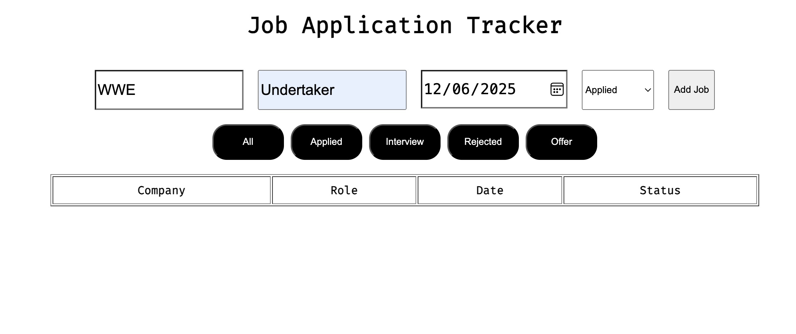

🗂️ Job Tracker App
A simple front-end project to track job applications using vanilla JavaScript and HTML. This app demonstrates managing dynamic data, manipulating the DOM, and persisting data with localStorage.

📝 Project Brief
This project is a practical exercise in:

Handling form submissions and events

Dynamically creating and removing table rows

Saving, retrieving, and updating data in browser localStorage

Keeping UI and data in sync

📸 Screenshot

🚀 Features
✅ Add jobs with company, role, date, and status

✅ Display job list in a dynamic table

✅ Delete job entries from table and localStorage

✅ Persist job data between page reloads using localStorage

✅ Simple, clean UI with form validation basics

🎯 Purpose
This project was built to:

Practice working with localStorage and JSON data

Learn dynamic DOM manipulation with JavaScript

Understand event handling and data persistence

Strengthen foundational front-end JavaScript skills

🛠️ Technologies Used
HTML5

JavaScript (ES6+)

Browser localStorage API

📂 Folder Structure
job-tracker/
│
├── index.html
├── script.js
├── styles.css (optional)
└── preview.png

💡 Lessons Learned & Reflections
"This project reinforced the importance of syncing UI updates with persistent storage. Handling JSON stringify/parse and dynamically adding/removing DOM elements was challenging but rewarding. I also realized I need to plan how to identify and delete specific items from storage properly." — Joshua

📱 Next Steps (Optional)
Implement editing existing job entries

Add filtering and sorting by status or date

Improve form validation and UX

Add export/import functionality for jobs

Style with CSS for better responsiveness and visuals

📖 License
Free to use for learning or inspiration.